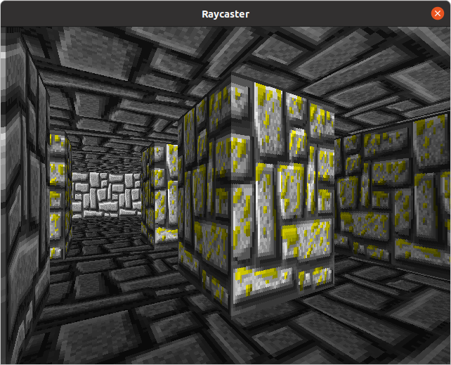
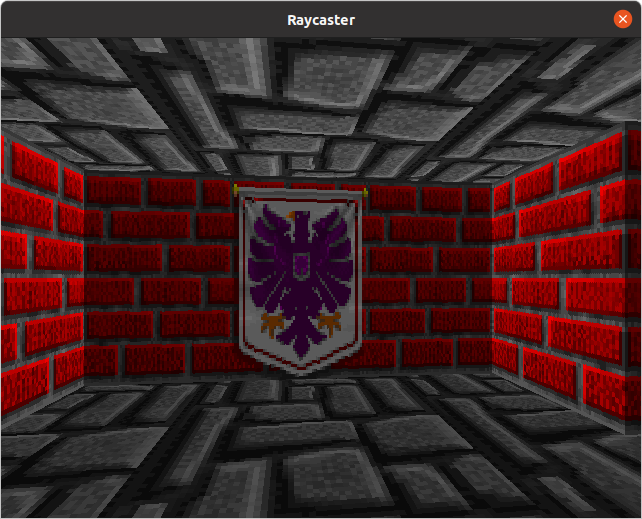
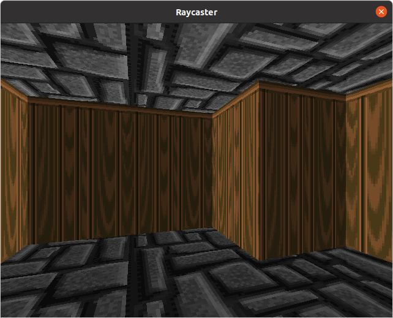
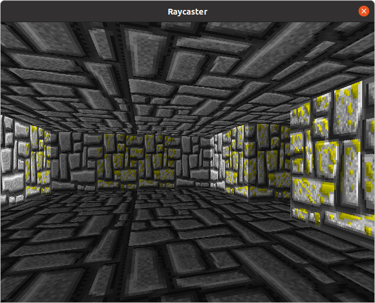

`wolfenstein_lite` is a demo I made after getting inspired by Wolfenstein 3D's rendering technique. I referred to [this](https://lodev.org/cgtutor/raycasting.html) cool guide whenever I got stuck.

|                                              |                                              |
|:--------------------------------------------:|:--------------------------------------------:|
|  |  |
|  |  |

The technique (ray-casting) allowed Wolfenstein to render a 3D world multiple times per second on insanely limited hardware. Watch [this](https://www.youtube.com/watch?v=eOCQfxRQ2pY) video for an overall idea about the technique and learn about a few interesting optimizations.

While the original devs (including the legendary John Carmack) optimized the hell out of W3D's code, same can't be said of my code. I focused on making things work.

## Building

I'm planning on adding Windows and Linux binaries to the releases section on GitHub. Till that happens, you'll have to do the following:

1. Ensure you've `cargo` setup properly. `cargo` is Rust's package manager. It can be installed using [rustup](https://rustup.rs/).
2. Do `cargo run --release` in the project's root directory.
3. This will kick-off the demo. Code will be compiled the first time you run that command. It will take some time.

## Controls

WASD for movement. Left and right arrow keys for turning.

## Customizing

`Config.toml` contains a bunch of configurable fields. Most of them are self-explanatory.

### Textures

They're configurable via the `tex` field in `Config.toml`. You can use your own textures. The textures must be RGB (i.e not RGBA) PNGs.

### Maps

Map files contain 2 things:

1. header containing space separated width and height
2. grid of characters (space means empty, hex-digit means a wall is present)

See [this](res/map/stronghold.map) if you want an example.

The hex-digit tells which texture to use: it's the index of a texture in `Config.toml`'s `tex` field. Use of hex limits the maximum number of textures to 16. But hey, constraints can spark creativity ;)

Storing maps separately from textures allows 'skinning' of maps.

## Random Note

It really sucks that GitHub flavored markdown doesn't allow embedding videos. Videos look way better than lifeless screenshots in this particular case.
